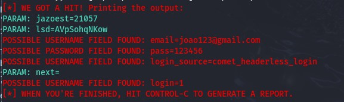

# Desafio-phishing

### Ferramentas

- Kali Linux
- setoolkit

### Configurando o Phishing no Kali Linux

- Acesso root: ``` sudo su ```
- Iniciando o setoolkit: ``` setoolkit ```
- Tipo de ataque: ``` Social-Engineering Attacks ```
- Vetor de ataque: ``` Web Site Attack Vectors ```
- Método de ataque: ```Credential Harvester Attack Method ```
- Método de ataque: ``` Site Cloner ```
- URL para clone: http://www.facebook.com


### Download do código fonte
-> Na pagina inicial, salve a página com o nome ```index.html```


### Editar código fonte

-> Edite o arquivo ```index.html``` e apague a linha do script onde o ```button ID`` está sendo chamado.


### Clonar a página do facebook

-> No ```setoolkit``` utilizaremos a opção de ```Custom Import``` e apontar para o arquivo ```index.html``` que editado.
-> Insira a URL ```http://facebook.com```


-> No navegador de uma outra estação, insira o IP do Kali Linux e a página do facebook será aberta.


### Resutado




